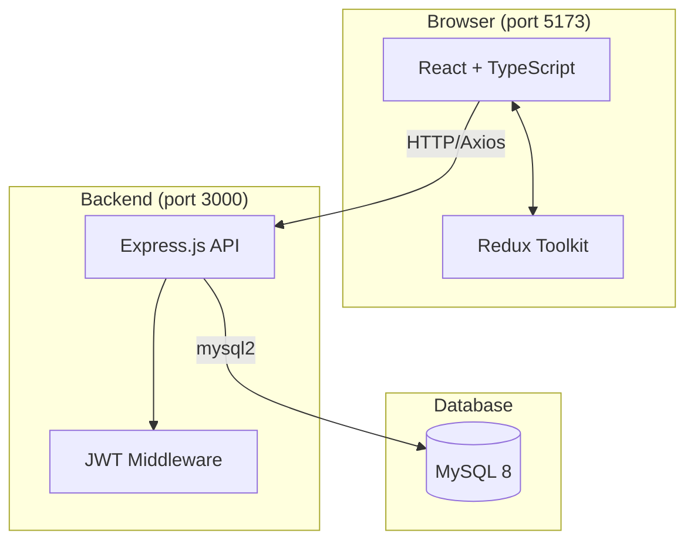
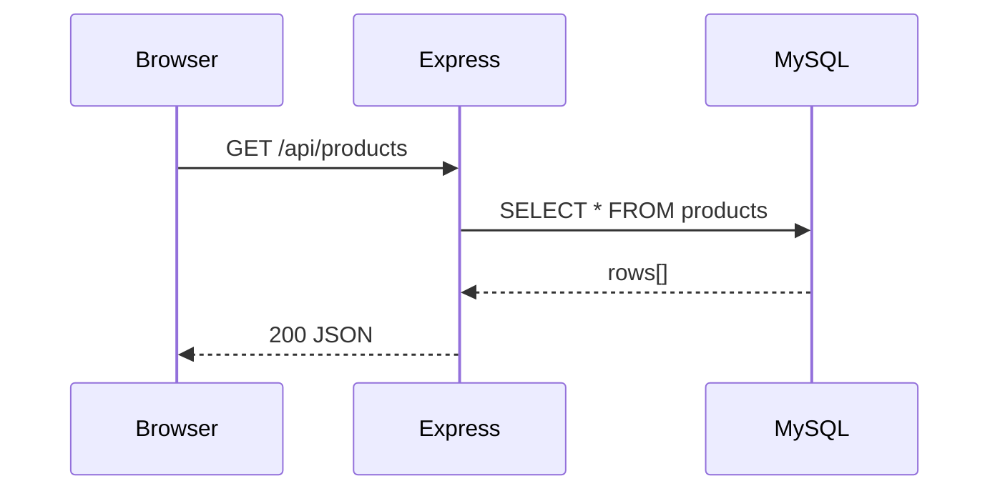
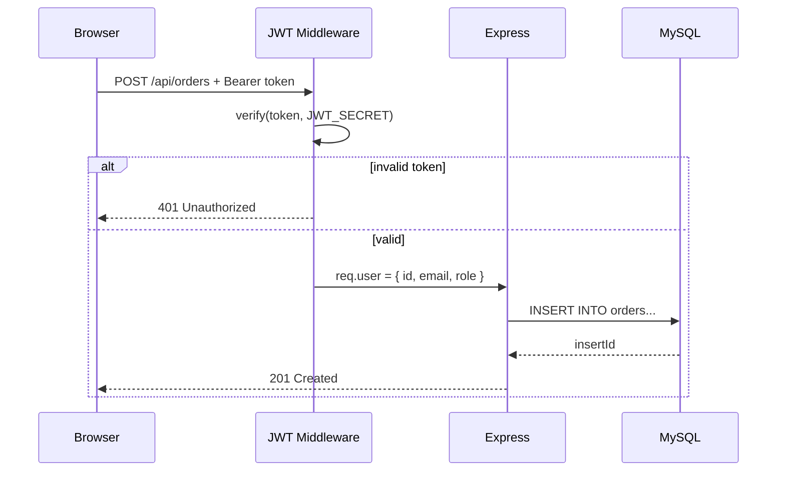
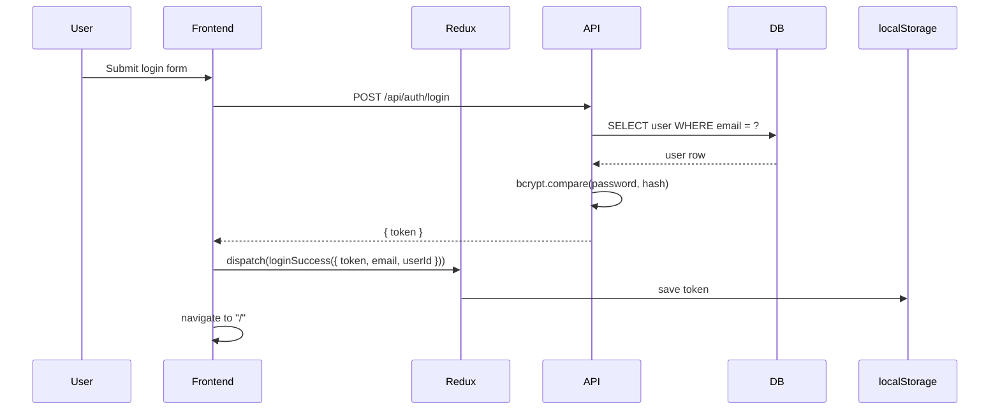
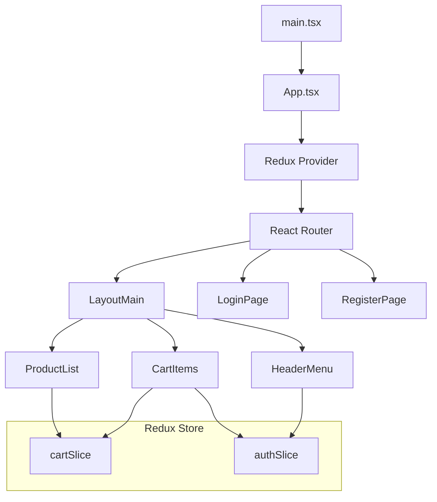

# Architecture

## System Overview



## Request Flow

### Public request (e.g. GET /api/products)



### Authenticated request (e.g. POST /api/orders)



## Authentication Flow



## Frontend Architecture



## Backend Structure

```
backend/src/
├── server.js          # HTTP server, listens on PORT
├── app.js             # Express app, CORS, routes mounting
├── config/
│   └── db.js          # mysql2 connection pool
├── controller/
│   ├── authController.js     # register, login, getMe
│   ├── productController.js  # CRUD products
│   └── orderController.js    # createOrder
├── middleware/
│   └── authMiddleware.js     # JWT verification
└── routers/
    ├── authRoutes.js    # /api/auth/*
    ├── productRoutes.js # /api/products/*
    └── orderRoutes.js   # /api/orders/*
```
