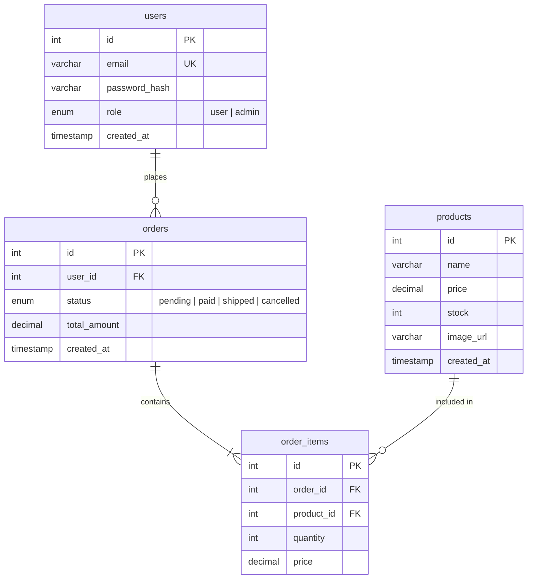

# Database

**Engine:** MySQL 8  
**Database name:** `ecommerce_node_react`

## ER Diagram

## Tables

### users

| Column | Type | Notes |
|---|---|---|
| id | INT AUTO_INCREMENT | PK |
| email | VARCHAR(255) | UNIQUE NOT NULL |
| password_hash | VARCHAR(255) | bcrypt hash |
| role | ENUM | `user` (default), `admin` |
| created_at | TIMESTAMP | DEFAULT NOW() |

### products

| Column | Type | Notes |
|---|---|---|
| id | INT AUTO_INCREMENT | PK |
| name | VARCHAR(255) | NOT NULL |
| price | DECIMAL(10,2) | NOT NULL |
| stock | INT | DEFAULT 0 |
| image_url | VARCHAR(500) | |
| created_at | TIMESTAMP | DEFAULT NOW() |

### orders

| Column | Type | Notes |
|---|---|---|
| id | INT AUTO_INCREMENT | PK |
| user_id | INT | FK → users.id |
| status | ENUM | `pending`, `paid`, `shipped`, `cancelled` |
| total_amount | DECIMAL(10,2) | |
| created_at | TIMESTAMP | DEFAULT NOW() |

### order_items

| Column | Type | Notes |
|---|---|---|
| id | INT AUTO_INCREMENT | PK |
| order_id | INT | FK → orders.id |
| product_id | INT | FK → products.id |
| quantity | INT | NOT NULL |
| price | DECIMAL(10,2) | Snapshot giá lúc đặt hàng |

## Notes

- `order_items.price` lưu giá tại thời điểm đặt hàng, không phải giá hiện tại của sản phẩm.
- `orders` và `order_items` nên được insert trong cùng một transaction để tránh dữ liệu không nhất quán.
