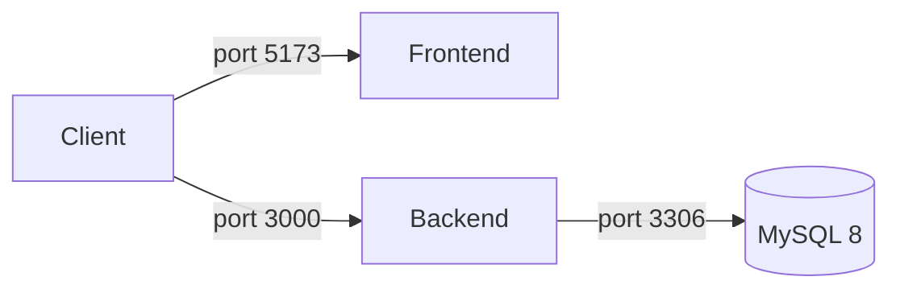

# Deployment Guide

## Docker (Recommended)

### Services



| Service | Image | Port |
|---|---|---|
| backend | build from Dockerfile | 3000 |
| mysql | mysql:8 | 3306 |

### Start

```bash
cd backend

# First time — copy and fill env
cp .env.example .env

# Start all services
docker-compose up -d

# View logs
docker-compose logs -f backend
docker-compose logs -f mysql
```

### Stop

```bash
docker-compose down           # stop, keep volumes
docker-compose down -v        # stop + delete MySQL data
```

## Dockerfile (Backend)

```dockerfile
FROM node:20-alpine
WORKDIR /app
COPY package*.json ./
RUN npm install
COPY . .
EXPOSE 3000
CMD ["npm", "run", "dev"]
```

- Base: `node:20-alpine` (lightweight)
- Source mounted as volume for hot reload in dev
- Port: `3000`

## Frontend (Static Build)

The frontend is a Vite SPA — build and serve via any static host:

```bash
cd frontend
npm run build       # outputs to dist/
```

Serve `dist/` with Nginx, Vercel, Netlify, or any static host.

**Nginx example:**
```nginx
server {
    listen 80;
    root /var/www/dist;
    index index.html;
    location / {
        try_files $uri $uri/ /index.html;
    }
    location /api {
        proxy_pass http://backend:3000;
    }
}
```

## Environment Variables

Set in `backend/.env` before starting containers. See [Development Guide](development.md#environment-variables) for the full list.

In production, set `JWT_SECRET` to a long random string and never commit `.env` to git.

## Database Init

On first start, create the schema:

```sql
CREATE DATABASE IF NOT EXISTS ecommerce_node_react;
USE ecommerce_node_react;

-- See docs/database.md for full table definitions
```
